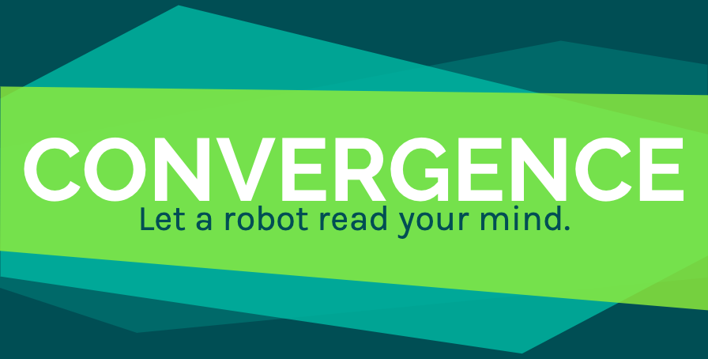

People should have more fun! Convergence, also called Mindmeld, is a popular game among certain groups- especially improvisors- though it is not yet well-known to the general public. The bot allows people to play the game when no one else is around, creating joy and popularizing a game whose main goal is to get people to be on the same page. 

## Understanding the Data
The model utilizes pre-trained word vectors from <a href="https://catalog.ldc.upenn.edu/LDC2011T07">Gigawords</a> and <a href="https://dumps.wikimedia.org/backup-index.html">2014 Wikimedia dumps</a>. I preferred to use this corpora of text rather than Twitter or some other scholarly articles source since it seems to be a sweet spot in the middle of how people might quickly associate words but also not too dimwitted. 

It's important to note that I could train (or even "brand") this bot in any way I wanted  simply by limiting the vocabulary, just like what I did in the <a href="https://github.com/MIAISEMAN/convergence-bot/blob/master/convergence/espanol/espanol_notebook.ipynb">Spanish notebook</a>. Thus, to understand the data, you have to understand who will be playing the game and why. In my preliminary case, anyone who speaks English will be playing for fun and to satisfy their curiosity.  

## Data Preparation and Modeling
To reproduce how I prepared the data for modeling, please see <a href="https://github.com/MIAISEMAN/convergence-bot/blob/master/convergence_notebook.ipynb">my Jupyter Notebook</a>. 

The game's functions are contained in the convergence.py file. It operates on just two functions. The third function is just a wrapper to play the game in the terminal instead of online. 

### How does it work?
In short:  
1) Take the pre-trained word vectors as the bot's vocabulary (the bot understands 400,000 different words).  
2) Take the two beginning words and find the average of their vectors.  
3) The bot responds with one of the ~8,500 most common words that is closest (cosine similarity) to the average of the two beginning vectors. 
4) If there is a match, convergence! Game over! 
5) If there's no match, repeat the process until there is.
 
##Evaluation
The unofficial, anecdotal reviews have been positive. I wasn't able to get more than 10 people to record their interactions with the game. I have a few improvements I would make in the future: 
 
* It would be great to incorporate the input “answers” from the other player immediately into the corpus of text. That way, if after many rounds, a person has answered “dog” several more times than “puppy,” the computer will give a preference to dog instead of puppy in the future, where it makes sense.  
* I don't want my bot to start with any of the smaller words. Rather than limiting the bot's response, since these are supposedly the top 8000 most commonly used words, I am going to limit my bot's initial "random" response to be within the first 2000 common words to avoid weird starts to the game.  
* Technically, the game should be played with all words available as options, but since people will not often go through every lemma/stem/conjugation of a word before they change ideas or paths, I would like my bot to do the same thing. The lemmatization didn't seem to be as effective as I would like. I'd love to revisit this aspect in the future. Perhaps the bot could even have phrases in its vocabulary and common words as well, so that "soccer" and "woman" could converge to "Megan Rapinoe" or something along those lines.

##Deployment
### Current: 
The English game is live at <a href="www.playconvergence.com">www.playconvergence.com</a>! It is deployed on an EC2, and I used the <a href="https://startbootstrap.com/themes/grayscale/">Grayscale bootstrap template</a> to make it real pretty. 

The Spanish can be played from the terminal! ($ python convergence_esp.py from that directory)

If you helped me with this game, you know who you are, and THANKS again. Maybe I could have done it without you, but not nearly as quickly. From inception to writing this file, I worked about 100 hours over 12 days, with the most time spent on the deployment.  

### Future: 
Website improvements I would like to make:   
1) Have a better "convergence experience" - play sound and have a modal pop up! Show some stats from other players!?  
2) Add a link to the Spanish version webapp once it's created.

Other potential deployments:  
* Amazon Alexa skill ("Alexa, play Convergence with me!")
* Human strangers playing with each other remotely 
* A bot trained on Twitter vocabulary and a bot trained on scholarly articles try and converge. ("See, folks, even when you come from different worlds, it's possible to get along!") 
* Duolingo app or classroom aide that enables you to see word defintions in your native language while playing in a different language

The possibilities are endless! 

